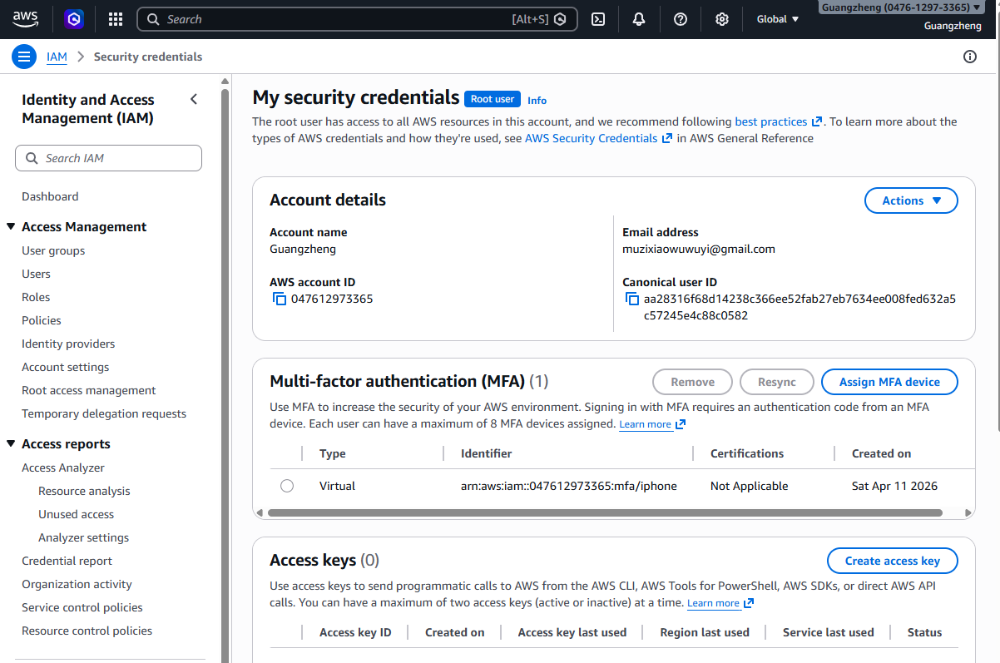
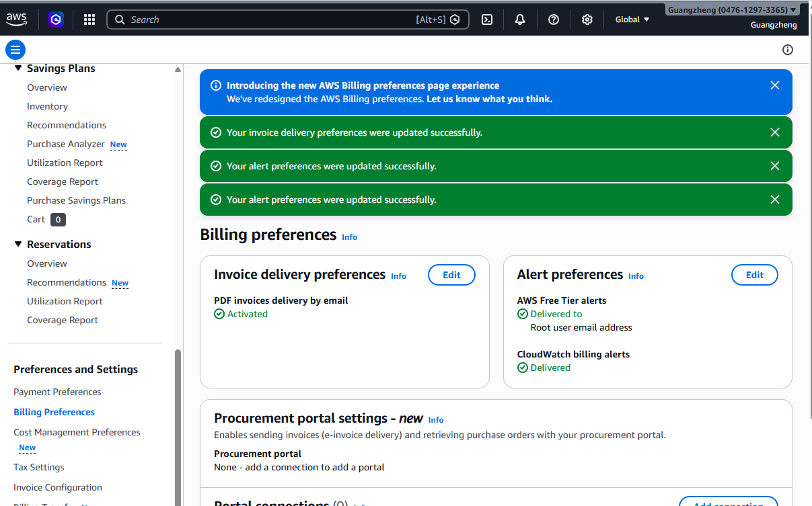
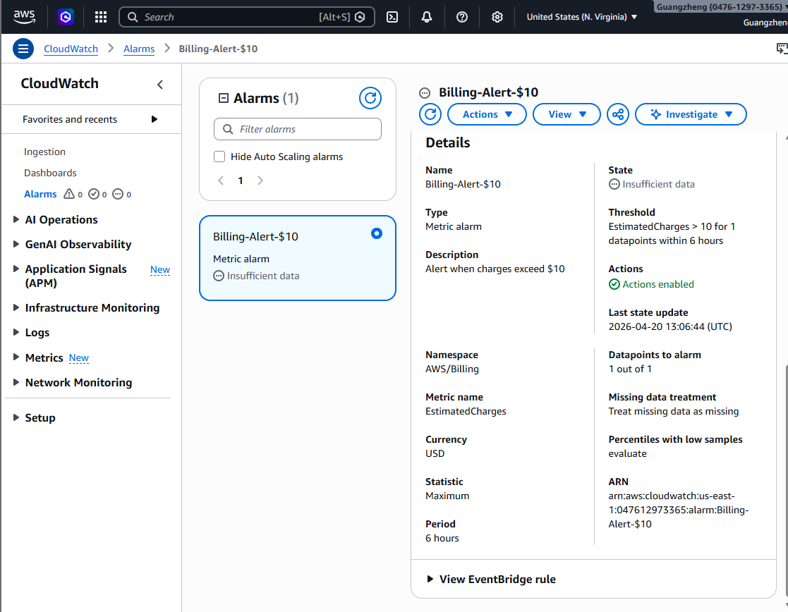
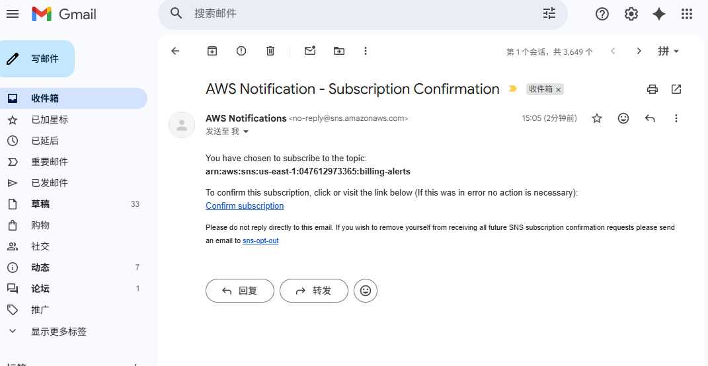
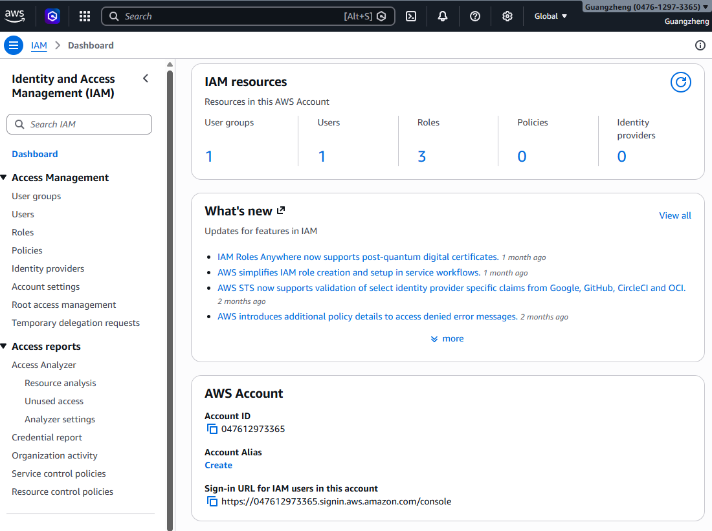
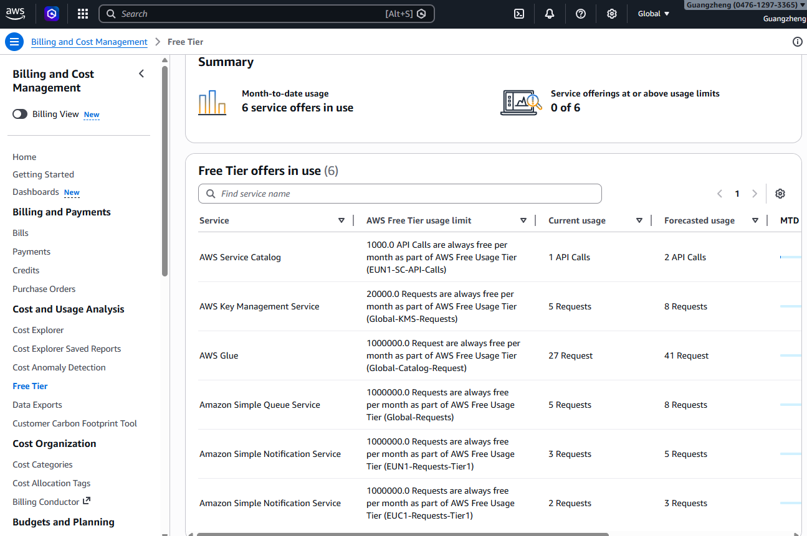

# AWS Account Setup Lab - Solution

**Student Name:** Guangzheng Li
**Date Completed:** 20/04/2026

---

## Exercise 1: MFA Configuration

### Screenshot:

### Notes:
- Authenticator app used: Passkey or security key（iPhone）
- MFA setup completed successfully: Yes 
- Backup codes saved: N/A (Not provided by AWS for Virtual MFA)

---

## Exercise 2: Billing Alerts

### Screenshots:

**Billing Preferences:**

**Billing Alarm:**

**SNS Confirmation:**

### Configuration Details:
- Alert threshold: $10
- Email confirmed: Yes
- Additional thresholds created (bonus): [Yes / No - if yes, list amounts]

---

## Exercise 3: Account Alias

### Screenshot:

### Account Details:
- **Account Alias:** muzixiaowuwuyi-user1
- **Sign-In URL:** `https://047612973365.signin.aws.amazon.com/console`
- **Tested successfully:** Yes

---

## Exercise 4: Free Tier Dashboard

### Screenshot:

### Current Free Tier Usage Summary:

| Service | Current Usage | Free Tier Limit | Status |
|---------|--------------|-----------------|--------|
| EC2 | [0 hours / 750 hours] | 750 hours/month | Green |
| S3 | [0 GB / 5 GB] | 5 GB | Green|
| [Other services...] | | | |

<!-- As of the time of this screenshot, Amazon EC2 and Amazon S3 do not appear in the 'Offers in use' list because no active resources (such as running instances or storage buckets) have been created yet. The dashboard only tracks services with recorded usage. I have manually entered '0' for these services in the table to reflect their current status. -->

### Notes:
- Any services approaching limits? No
- Any unexpected usage? No

---

## Exercise 5: Reflection Questions

### 1. Why is MFA important even for a personal learning account?

**Your Answer:**
MFA adds a critical layer of security by requiring a physical device for verification. This prevents unauthorized access even if your password is leaked or weak, protecting you from unexpected AWS bills caused by account compromise.

---

### 2. What would happen if you left your root user unprotected?

**Your Answer:**
An unprotected Root user gives attackers full administrative control, leading to potential data breaches and the exposure of all IAM user credentials. Most critically, it risks massive financial loss if attackers launch high-cost resources for malicious activities like crypto-mining under your name.

---

### 3. How do billing alerts help prevent unexpected charges?

**Your Answer:**
Billing alerts act as an early warning system by notifying you via email when costs exceed your predefined threshold. This allows you to identify misconfigured resources or potential security breaches immediately, enabling you to stop the usage and minimize financial loss before the month ends.

---

### 4. What threshold did you set for your billing alert and why?

**Your Answer:**
I set the threshold at $10 as required by the exercise to trigger a CloudWatch Billing Alarm. This value serves as a safe baseline for a learning environment, providing an early warning to investigate any unexpected usage before significant costs accumulate.

---

### 5. What is your account alias and why did you choose it?

**Your Answer:**
- **Alias:**  muzixiaowuwuyi-user1
- **Reasoning:** I used a combination of my email name and "user1" as my account alias. I chose this format to simulate a real-world production environment where distinct aliases are often required to identify and manage multiple users or specific sub-accounts within an organization.

---

### 6. What services are you currently using according to the Free Tier dashboard?

**Your Answer:**
AWS Service Catalog
AWS Key Management Service
AWS Glue
Amazon Simple Queue Service
Amazon Simple Notification Service
Amazon Simple Notification Service

---

## Bonus Challenges Completed (Optional)

### Challenge 1: Multiple Billing Alert Thresholds

- [ ] $5 threshold
- [ ] $25 threshold
- [ ] $50 threshold

**Screenshots (if completed):**
[Add screenshots here]

---

### Challenge 2: CloudTrail Enabled

- [ ] CloudTrail enabled
- [ ] Logging to S3 configured

**Notes:**
[Add any notes about CloudTrail setup]

---

### Challenge 3: AWS Trusted Advisor Reviewed

- [ ] Accessed Trusted Advisor
- [ ] Reviewed recommendations

**Key recommendations found:**
[List any recommendations you found]

---

## Lessons Learned

**What was the most challenging part of this lab?**

[Your answer]

---

**What would you do differently next time?**

[Your answer]

---

**What security practices will you implement going forward?**

[Your answer]

---

## Checklist Before Submission

- [ ] All required screenshots captured and saved
- [ ] Screenshots are clear and show relevant information
- [ ] All reflection questions answered thoroughly
- [ ] Account alias documented
- [ ] Free Tier usage documented
- [ ] Work committed to Git
- [ ] Pull request created
- [ ] PR URL submitted to Student Portal

---

**Lab Completed By:** [Your Name]  
**Date:** [Date]
